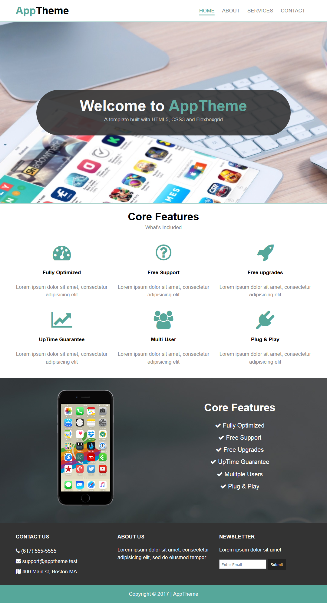

# app-theme
A try to study branching and also get familiar with FlexBoxGrid ,  which is a lightweight Flexbox based grid system to align elements easily
## Table of contents
* [General info](#general-info)
* [Screenshots](#screenshots)
* [Technologies](#technologies)
* [Setup](#setup)
* [Features](#features)
* [Status](#status)
* [Inspiration](#inspiration)
* [Summary](#Summary)
* [Contact](#contact)

## General info
The Motivation behind this project is to get more comfortable with branching and dividing problems into smaller ones using user-stories and agile way of thinking , also explore HTML5 and CSS3 , FlexboxGrid responsive template .
## Screenshots
This is a screen-shot of the final live demo of this project.

## Technologies
* HTML5 /CSS , FlexboxGrid responsive template .

## Setup
Clone the repository 
Open using Visual studio code ..
Explore...

## Features
The project is divided into many steps as user-stories , please read DevelopmentStrategy.md for more details about each user story,
Eech one of them is mapped to one or more branches as follows

| User-Story Name        | Branch Name        
| ------------- |:-------------:| 
|  __CreateTheSkeltonHtmlTagsForMainLandingPage__  | add-header-navbar-logo 
| __CreateTheSkeltonHtmlTagsForMainLandingPage__ | create-basic-folders-pages 
| __CreateTheMiddleSectionsForTheHtmlIndexPage__ | add-middlesections-indexpage 
|  __CreateStyleFileForTheMainLandingPage__ |  update-stylefile-forindexpage 
| __CreateServices&About&ContactPages__  | update-about-htmlpage 
| __CreateServices&About&ContactPages__  | update-services-htmlpage 
| __CreateServices&About&ContactPages__ | update-contact-htmlpage  
| __AddCssCodeForLinkedPages__ | update-style-linkedpages 
| __AddResponsiveEdge__ | add-style-mediaqueries |
  

## Status
Project is: finished as it is for learninig purpose.

## Inspiration
 Based on the "Build A Responsive HTML & CSS Template With FlexboxGrid" youtube tutorial from Traversy Media.

## Contact
Created by Rasha Ali https://rashaali84.github.io/ - feel free to contact me over GitHub!

## Summary
 ## Here you are a summery of what I struggled with, what I learned, and what skills I need to practice further.

| __My Learning points__ | As a web developer I learned how to downsize projects to smaller parts and attach this small parts in order and the way of building up projects in a way I can track down the smallest commits and reverse it back if needed , without rolling back the whole master thread . so more productivity with more organized plan and less mess and less efforts .when we compare that model with the waterfall classic project life cycles in which every step is built on the previous one and rolling back in those type of projects is a big problem and that is not convenient with real life projects , also I get more comfortable in using flexboxgrid template and how to add customized css code to enhance the overall look of the website .

| __Skills to be practiced more__ | As a web developer I get more comfortable in using git commands form git bash terminal and the right sequence of pushing and pulling and branching .Also I learned how writing user stories ahead to organize my work in the project, in addition to using felxboxgrid template as a base for a website html design.

| __Struggles__ | There was no struggle , tools like github and git and atom were really smooth and easy to use and once you do the prep-work well ,going through homework is a smooth process . 

Thank you ...

